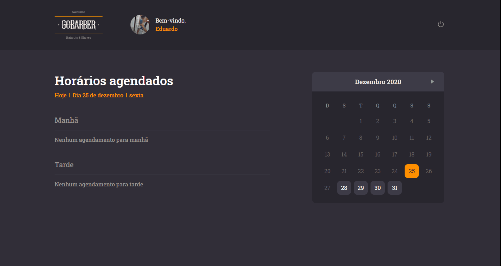

The simplest way to organize yourself.

## About 🔎:
#### This APP provides multiple features, such as:
- Create a new appointment;
- Create a new user.
- Edit a profile;
- Reset a forgotten password;
- List the availability of one service provider;
- List service providers;
- Secure routes using authentication;

## Technologies 💻:
- Multer
- NodeMailer
- BCrypt
- Date-fns
- Express
- Tsyringe
- TypeORM
- RateLimiter
- JWT Token
- UUIDV4
- Jest
- PostgreSQL
- Redis
- MongoDB

## How to Run 🚀:
Go into the submodules of each stack to read the steps.
